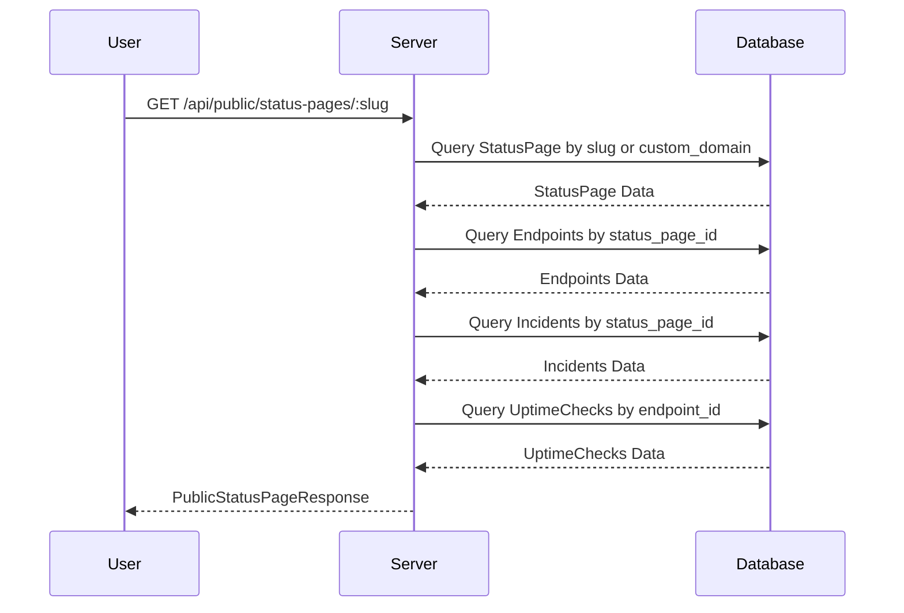
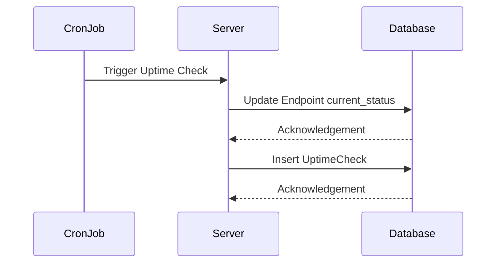

# Flujos de Datos de Statura

## Diagrama de Secuencia de Flujos Clave

### Flujo de Solicitud de Página de Estado Pública

```mermaid
sequenceDiagram
    participant User
    participant Server
    participant Database
    User->>Server: GET /api/public/status-pages/:slug
    Server->>Database: Query StatusPage by slug or custom_domain
    Database-->>Server: StatusPage Data
    Server->>Database: Query Endpoints by status_page_id
    Database-->>Server: Endpoints Data
    Server->>Database: Query Incidents by status_page_id
    Database-->>Server: Incidents Data
    Server->>Database: Query UptimeChecks by endpoint_id
    Database-->>Server: UptimeChecks Data
    Server-->>User: PublicStatusPageResponse
```

### Flujo de Actualización de Estado de Endpoint

```mermaid
sequenceDiagram
    participant CronJob
    participant Server
    participant Database
    CronJob->>Server: Trigger Uptime Check
    Server->>Database: Update Endpoint current_status
    Database-->>Server: Acknowledgement
    Server->>Database: Insert UptimeCheck
    Database-->>Server: Acknowledgement
```