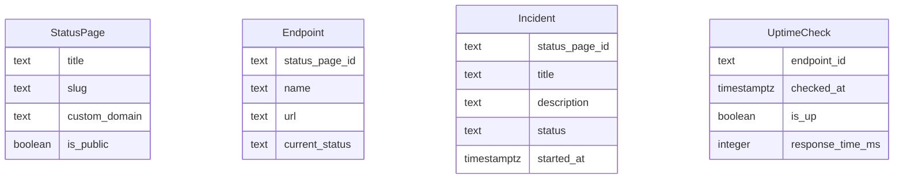

# Modelo de Datos de Statura

## Diagrama ER

## Descripción de Entidades y Relaciones

- **StatusPage**: Representa una página de estado pública. Tiene un título, un slug único, un dominio personalizado opcional y un indicador de visibilidad pública.
- **Endpoint**: Asociado a una StatusPage, representa un endpoint HTTPS monitoreado. Incluye el nombre, URL y estado actual.
- **Incident**: Relacionado con una StatusPage, describe un incidente con un título, descripción, estado y tiempo de inicio.
- **UptimeCheck**: Asociado a un Endpoint, registra una verificación de tiempo de actividad con la marca de tiempo, estado de actividad y tiempo de respuesta.