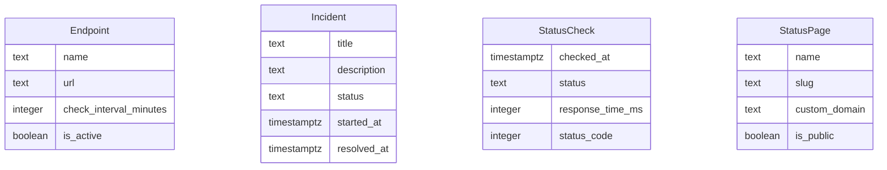

```mermaid
erDiagram
  Endpoint {
    text name
    text url
    integer check_interval_minutes
    boolean is_active
  }
  Incident {
    text title
    text description
    text status
    timestamptz started_at
    timestamptz resolved_at
  }
  StatusCheck {
    timestamptz checked_at
    text status
    integer response_time_ms
    integer status_code
  }
  StatusPage {
    text name
    text slug
    text custom_domain
    boolean is_public
  }
```