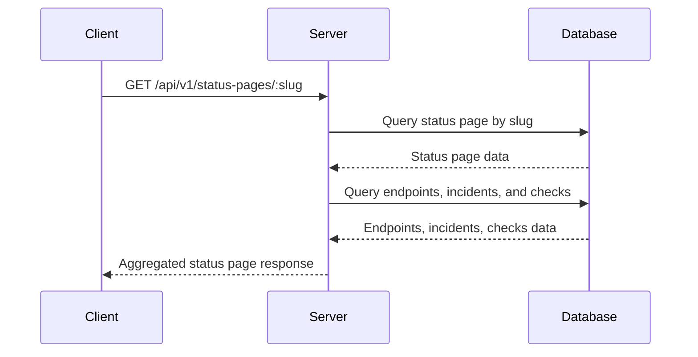
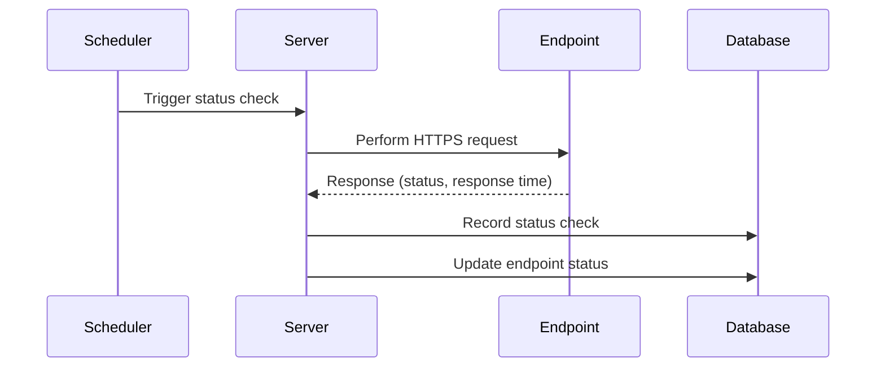
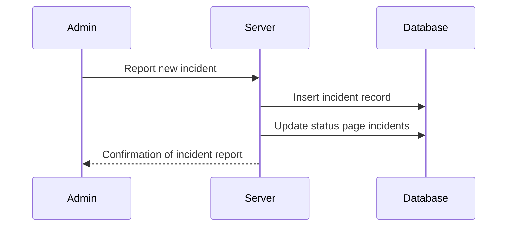

# Data Flows

## Key User/Data Flows

### Fetching Status Page

```mermaid
sequenceDiagram
    participant Client
    participant Server
    participant Database

    Client->>Server: GET /api/v1/status-pages/:slug
    Server->>Database: Query status page by slug
    Database-->>Server: Status page data
    Server->>Database: Query endpoints, incidents, and checks
    Database-->>Server: Endpoints, incidents, checks data
    Server-->>Client: Aggregated status page response
```

### Monitoring Endpoints

```mermaid
sequenceDiagram
    participant Scheduler
    participant Server
    participant Endpoint
    participant Database

    Scheduler->>Server: Trigger status check
    Server->>Endpoint: Perform HTTPS request
    Endpoint-->>Server: Response (status, response time)
    Server->>Database: Record status check
    Server->>Database: Update endpoint status
```

### Incident Management

```mermaid
sequenceDiagram
    participant Admin
    participant Server
    participant Database

    Admin->>Server: Report new incident
    Server->>Database: Insert incident record
    Server->>Database: Update status page incidents
    Server-->>Admin: Confirmation of incident report
```