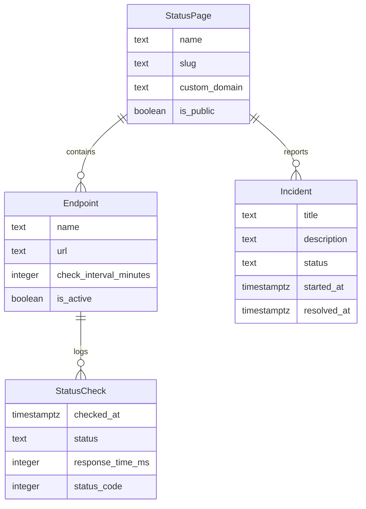

# Data Model

## ER Diagram

## Entity Descriptions
- **Endpoint**: Represents a monitored HTTPS endpoint with details like name, URL, check interval, and active status.
- **Incident**: Describes an incident affecting an endpoint or the entire status page, including title, description, status, and timestamps.
- **StatusCheck**: Logs the result of a status check on an endpoint, including the time of check, status, response time, and HTTP status code.
- **StatusPage**: Represents a public status page, including its name, slug, custom domain, and visibility status.