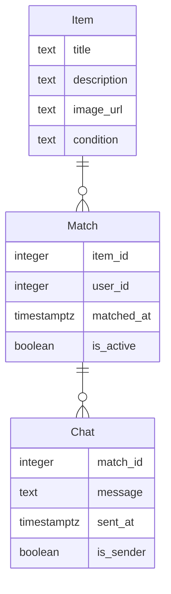

# Modelo de Datos de Truke

## Diagrama ER

## Descripción de Entidades y Relaciones
- **Item**: Representa un objeto que un usuario desea intercambiar o regalar. Incluye título, descripción, URL de imagen y condición.
- **Match**: Representa un emparejamiento entre un item y un usuario. Incluye el ID del item, ID del usuario, fecha del match y si está activo.
- **Chat**: Contiene mensajes intercambiados entre usuarios sobre un item que hizo match. Incluye el ID del match, el mensaje, fecha de envío y un indicador de si el usuario es el remitente.