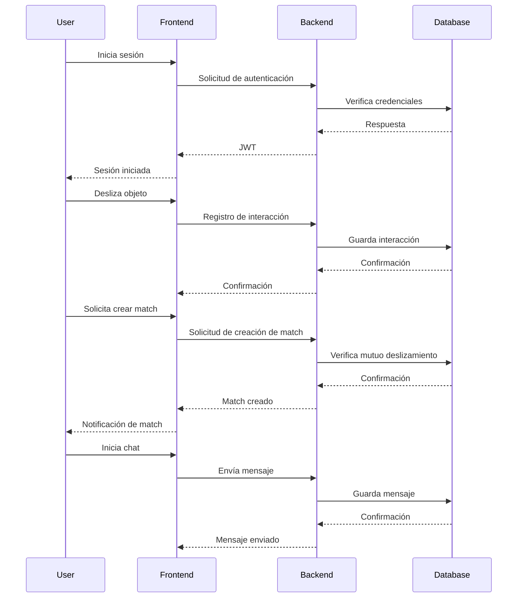

# Arquitectura de Truke

## Visión General del Sistema
Truke es una aplicación similar a Tinder para intercambiar y regalar objetos usados. Los usuarios pueden deslizar fotos de objetos, publicar los suyos y, si hay un match mutuo, chatear de forma anónima sobre los ítems que hicieron match.

## Mapa de Componentes/Módulos
- **Frontend**: Construido con Next.js 16 y TypeScript para una experiencia de usuario interactiva y moderna.
- **Backend**: Implementado en Node.js con TypeScript, utilizando PostgreSQL como base de datos a través de un pooler para manejar conexiones eficientes.
- **Autenticación**: JWT (JSON Web Tokens) para manejar sesiones de usuario de manera segura.
- **Pagos**: Integración con Stripe para potenciales funcionalidades de monetización.
- **Notificaciones**: Resend para el envío de correos electrónicos y notificaciones.
- **Despliegue**: Fly.io para el backend y Vercel para el frontend, aprovechando sus capacidades de despliegue continuo y escalabilidad.

## Stack y Razones
- **Next.js 16**: Ofrece SSR (Server-Side Rendering) y SSG (Static Site Generation), mejorando el SEO y el rendimiento.
- **TypeScript**: Proporciona tipado estático, lo que reduce errores y mejora la mantenibilidad del código.
- **PostgreSQL**: Una base de datos relacional robusta que maneja eficientemente las relaciones entre entidades como `Item`, `Match` y `Chat`.
- **Fly.io y Vercel**: Proporcionan un entorno de despliegue rápido y escalable, ideal para aplicaciones modernas.

## Flujo de Solicitudes
1. **Autenticación**: El usuario inicia sesión y recibe un JWT.
2. **Deslizamiento de Objetos**: El usuario desliza objetos, y las interacciones se registran en el backend.
3. **Creación de Match**: Si ambos usuarios deslizan a la derecha, se crea un match.
4. **Chat**: Los usuarios pueden chatear sobre los ítems que hicieron match.

