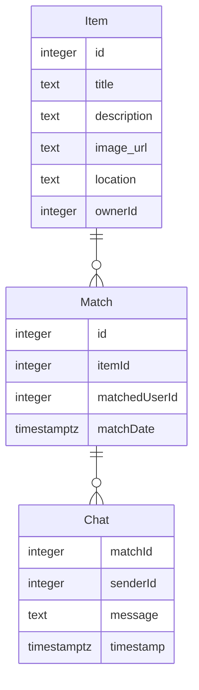

# Modelo de Datos de Truke

## Diagrama ER

## Descripción de Entidades y Relaciones

### Entidades
- **Item**: Representa un objeto que un usuario desea intercambiar o regalar. Incluye título, descripción, URL de imagen, ubicación y el ID del propietario.
- **Match**: Representa una coincidencia entre dos usuarios que han deslizado a la derecha en los objetos del otro. Incluye el ID del objeto, el ID del usuario coincidente y la fecha del match.
- **Chat**: Contiene los mensajes enviados entre dos usuarios que han hecho match. Incluye el ID del match, el ID del remitente, el mensaje y la marca de tiempo.

### Relaciones
- Un `Item` puede tener múltiples `Match` asociados.
- Un `Match` puede tener múltiples `Chat` asociados, representando la conversación entre los usuarios.