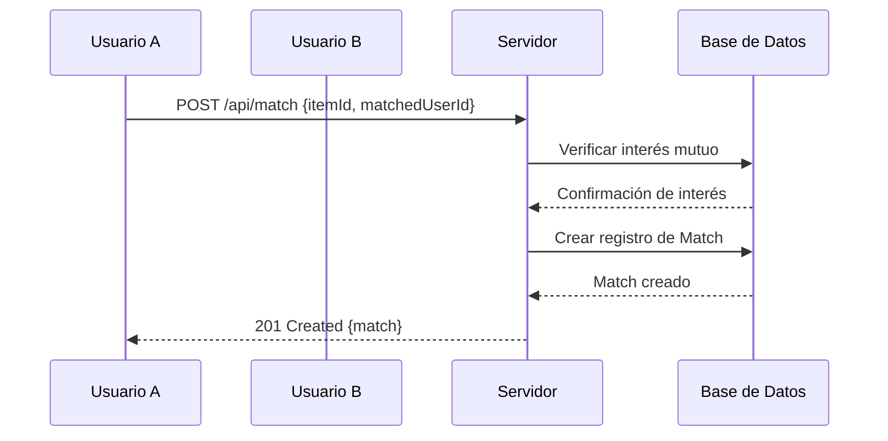
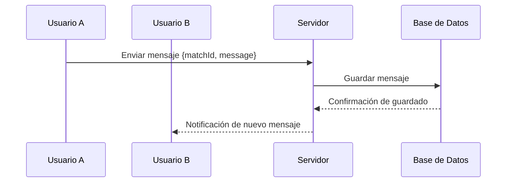

# Flujos de Datos en Truke

## Flujo de Creación de Match

```mermaid
sequenceDiagram
    participant UserA as Usuario A
    participant UserB as Usuario B
    participant Backend as Servidor
    participant DB as Base de Datos

    UserA->>Backend: POST /api/match {itemId, matchedUserId}
    Backend->>DB: Verificar interés mutuo
    DB-->>Backend: Confirmación de interés
    Backend->>DB: Crear registro de Match
    DB-->>Backend: Match creado
    Backend-->>UserA: 201 Created {match}
```

## Flujo de Mensajería en el Chat

```mermaid
sequenceDiagram
    participant UserA as Usuario A
    participant UserB as Usuario B
    participant Backend as Servidor
    participant DB as Base de Datos

    UserA->>Backend: Enviar mensaje {matchId, message}
    Backend->>DB: Guardar mensaje
    DB-->>Backend: Confirmación de guardado
    Backend-->>UserB: Notificación de nuevo mensaje
```