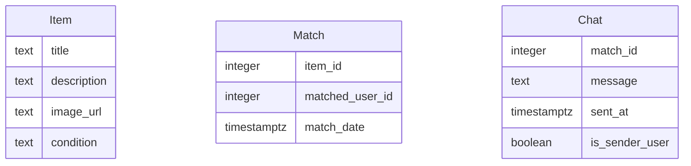

# Modelo de Datos de Truke

## Diagrama ER

## Descripción de Entidades y Relaciones
- **Item**: Representa un objeto que un usuario desea intercambiar o regalar. Incluye un título, descripción, URL de imagen y condición del objeto.
- **Match**: Registra un interés mutuo entre dos usuarios sobre un objeto. Contiene el ID del objeto, el ID del usuario que mostró interés y la fecha del match.
- **Chat**: Almacena los mensajes intercambiados entre dos usuarios que han hecho match. Incluye el ID del match, el contenido del mensaje, la fecha de envío y un indicador de quién envió el mensaje.