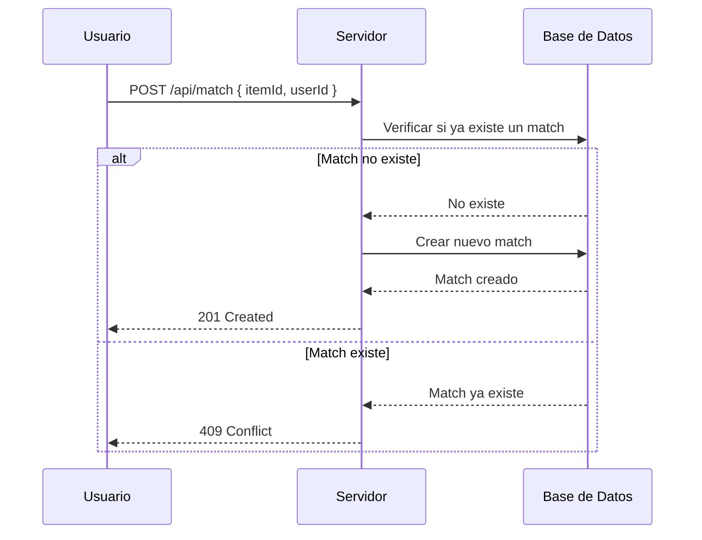
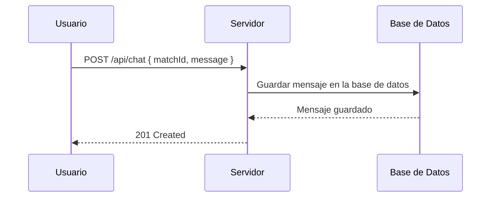

# Flujos de Datos

## Flujo de Usuario: Crear un Match

```mermaid
sequenceDiagram
    participant U as Usuario
    participant S as Servidor
    participant DB as Base de Datos

    U->>S: POST /api/match { itemId, userId }
    S->>DB: Verificar si ya existe un match
    alt Match no existe
        DB-->>S: No existe
        S->>DB: Crear nuevo match
        DB-->>S: Match creado
        S-->>U: 201 Created
    else Match existe
        DB-->>S: Match ya existe
        S-->>U: 409 Conflict
    end
```

## Flujo de Usuario: Enviar un Mensaje de Chat

```mermaid
sequenceDiagram
    participant U as Usuario
    participant S as Servidor
    participant DB as Base de Datos

    U->>S: POST /api/chat { matchId, message }
    S->>DB: Guardar mensaje en la base de datos
    DB-->>S: Mensaje guardado
    S-->>U: 201 Created
```