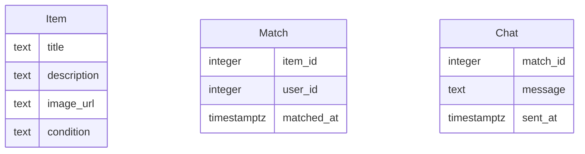

# Modelo de Datos

## Diagrama ER

## Descripción de Entidades y Relaciones
- **Item**: Representa un objeto que un usuario desea intercambiar o regalar. Incluye título, descripción, URL de imagen y condición.
- **Match**: Representa un acuerdo mutuo entre dos usuarios interesados en los items del otro. Contiene referencias al item y al usuario.
- **Chat**: Almacena mensajes enviados entre dos usuarios que han hecho match. Cada mensaje está asociado a un match específico.