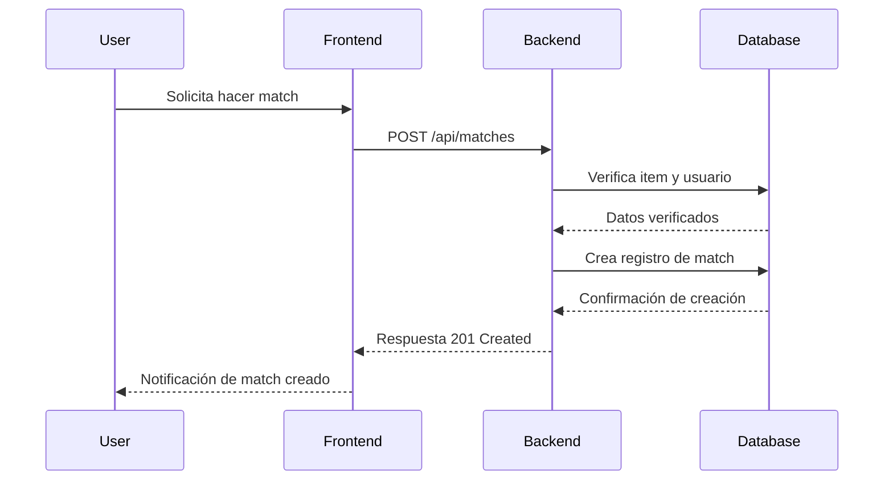
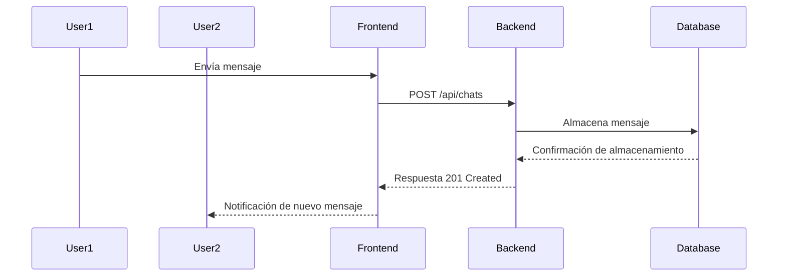

# Flujos de Datos en Truke

## Diagrama de Secuencia de Creación de Match

```mermaid
sequenceDiagram
    participant User
    participant Frontend
    participant Backend
    participant Database

    User->>Frontend: Solicita hacer match
    Frontend->>Backend: POST /api/matches
    Backend->>Database: Verifica item y usuario
    Database-->>Backend: Datos verificados
    Backend->>Database: Crea registro de match
    Database-->>Backend: Confirmación de creación
    Backend-->>Frontend: Respuesta 201 Created
    Frontend-->>User: Notificación de match creado
```

## Diagrama de Secuencia de Chat

```mermaid
sequenceDiagram
    participant User1
    participant User2
    participant Frontend
    participant Backend
    participant Database

    User1->>Frontend: Envía mensaje
    Frontend->>Backend: POST /api/chats
    Backend->>Database: Almacena mensaje
    Database-->>Backend: Confirmación de almacenamiento
    Backend-->>Frontend: Respuesta 201 Created
    Frontend-->>User2: Notificación de nuevo mensaje
```