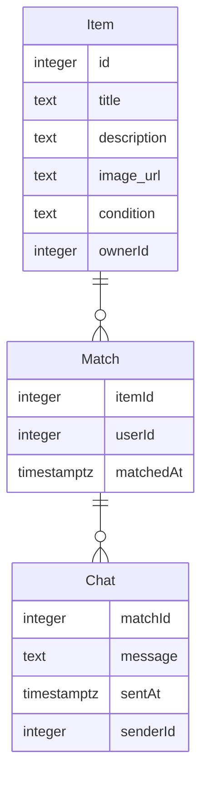

# Modelo de Datos de Truke

## Diagrama ER

## Descripción de Entidades y Relaciones
- **Item**: Representa un objeto que un usuario desea intercambiar o regalar. Incluye título, descripción, URL de imagen, condición y el ID del propietario.
- **Match**: Representa un interés mutuo entre dos usuarios sobre un item. Incluye el ID del item, el ID del usuario interesado y la fecha del match.
- **Chat**: Representa un mensaje enviado entre usuarios que han hecho match. Incluye el ID del match, el contenido del mensaje, la fecha de envío y el ID del remitente.