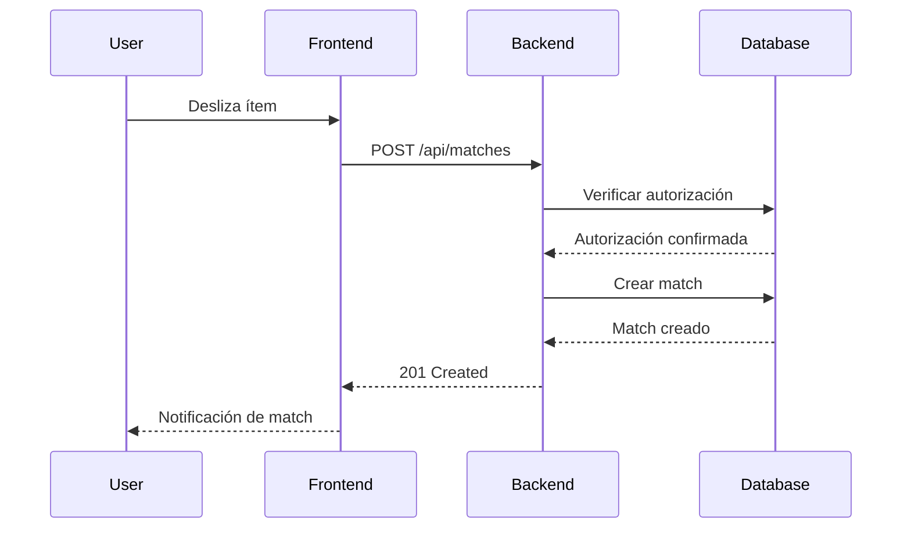
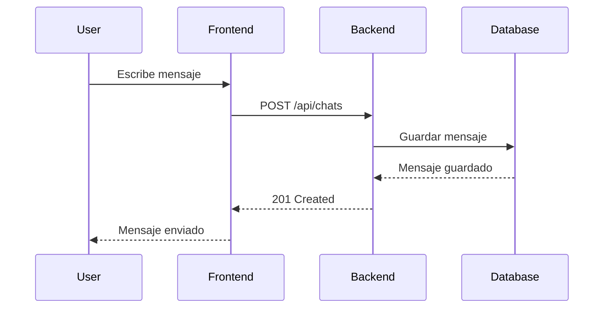

# Flujos de Datos en Truke

## Diagrama de Secuencia: Creación de Match

```mermaid
sequenceDiagram
    participant User
    participant Frontend
    participant Backend
    participant Database

    User->>Frontend: Desliza ítem
    Frontend->>Backend: POST /api/matches
    Backend->>Database: Verificar autorización
    Database-->>Backend: Autorización confirmada
    Backend->>Database: Crear match
    Database-->>Backend: Match creado
    Backend-->>Frontend: 201 Created
    Frontend-->>User: Notificación de match
```

## Diagrama de Secuencia: Envío de Mensaje en Chat

```mermaid
sequenceDiagram
    participant User
    participant Frontend
    participant Backend
    participant Database

    User->>Frontend: Escribe mensaje
    Frontend->>Backend: POST /api/chats
    Backend->>Database: Guardar mensaje
    Database-->>Backend: Mensaje guardado
    Backend-->>Frontend: 201 Created
    Frontend-->>User: Mensaje enviado
```