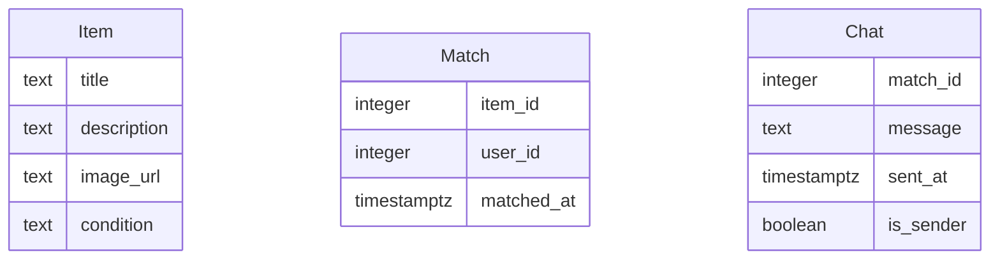

# Modelo de Datos de Truke

## Diagrama ER

## Descripción de Entidades
- **Item**: Representa un objeto que un usuario desea intercambiar o regalar. Incluye título, descripción, URL de imagen y condición.
- **Match**: Representa un interés mutuo entre dos usuarios sobre un ítem. Incluye el ID del ítem, el ID del usuario y la fecha de creación del match.
- **Chat**: Representa un mensaje enviado en el contexto de un match. Incluye el ID del match, el contenido del mensaje, la fecha de envío y un indicador de si el usuario es el remitente.