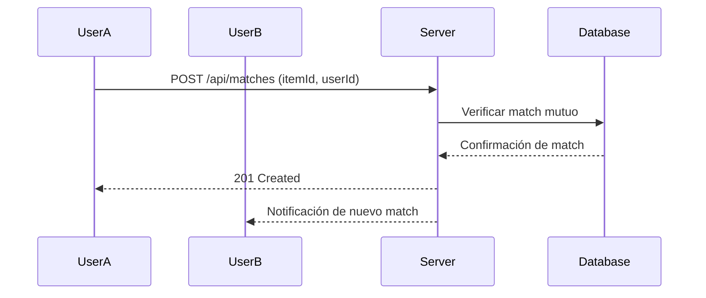
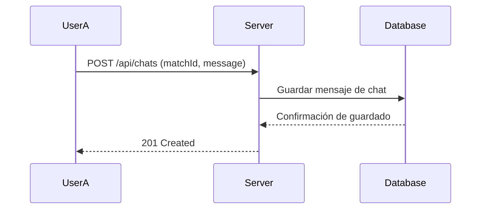

# Flujos de Datos Clave

## Diagrama de Secuencia: Crear Match

```mermaid
sequenceDiagram
    participant UserA
    participant UserB
    participant Server
    participant Database
    UserA->>Server: POST /api/matches (itemId, userId)
    Server->>Database: Verificar match mutuo
    Database-->>Server: Confirmación de match
    Server-->>UserA: 201 Created
    Server-->>UserB: Notificación de nuevo match
```

## Diagrama de Secuencia: Iniciar Chat

```mermaid
sequenceDiagram
    participant UserA
    participant Server
    participant Database
    UserA->>Server: POST /api/chats (matchId, message)
    Server->>Database: Guardar mensaje de chat
    Database-->>Server: Confirmación de guardado
    Server-->>UserA: 201 Created
```
