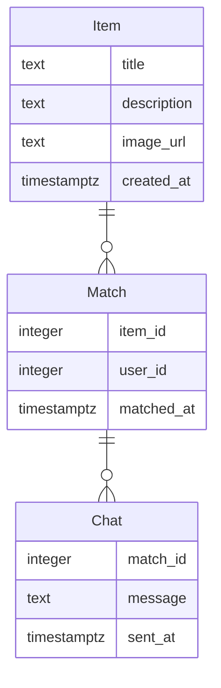

# Modelo de Datos

## Diagrama ER

## Descripción de Entidades y Relaciones
- **Item**: Representa un objeto que un usuario desea intercambiar o regalar. Incluye título, descripción, URL de imagen y fecha de creación.
- **Match**: Representa un match entre dos usuarios basado en sus ítems. Incluye el ID del ítem, ID del usuario y la fecha del match.
- **Chat**: Representa un mensaje en un chat entre dos usuarios que han hecho match. Incluye el ID del match, el mensaje y la fecha de envío.
