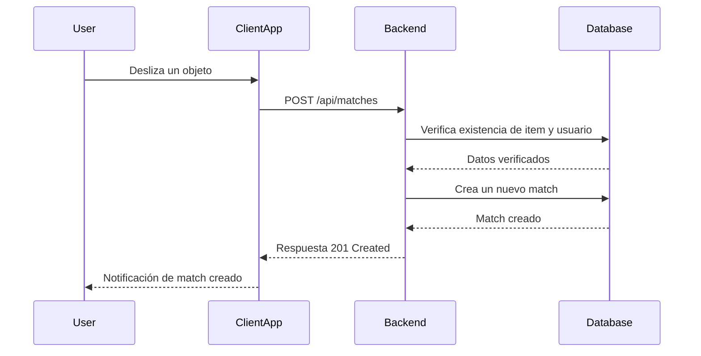
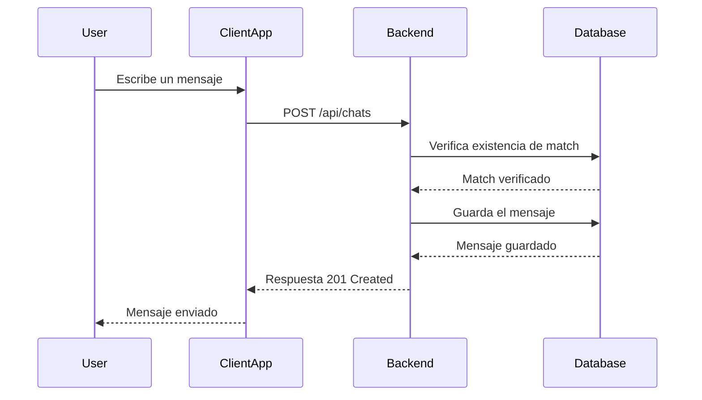

# Flujos de Datos en Truke

## Diagrama de Secuencia para Crear un Match

```mermaid
sequenceDiagram
    participant User
    participant ClientApp
    participant Backend
    participant Database

    User->>ClientApp: Desliza un objeto
    ClientApp->>Backend: POST /api/matches
    Backend->>Database: Verifica existencia de item y usuario
    Database-->>Backend: Datos verificados
    Backend->>Database: Crea un nuevo match
    Database-->>Backend: Match creado
    Backend-->>ClientApp: Respuesta 201 Created
    ClientApp-->>User: Notificación de match creado
```

## Diagrama de Secuencia para Enviar un Mensaje en el Chat

```mermaid
sequenceDiagram
    participant User
    participant ClientApp
    participant Backend
    participant Database

    User->>ClientApp: Escribe un mensaje
    ClientApp->>Backend: POST /api/chats
    Backend->>Database: Verifica existencia de match
    Database-->>Backend: Match verificado
    Backend->>Database: Guarda el mensaje
    Database-->>Backend: Mensaje guardado
    Backend-->>ClientApp: Respuesta 201 Created
    ClientApp-->>User: Mensaje enviado
```