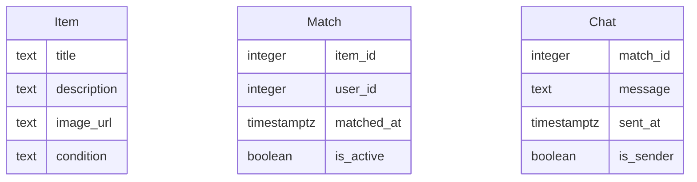

# Modelo de Datos de Truke

## Diagrama ER

## Descripción de Entidades y Relaciones

### Item
- **title**: Título del objeto.
- **description**: Descripción detallada del objeto.
- **image_url**: URL de la imagen del objeto.
- **condition**: Estado del objeto (nuevo, como nuevo, usado, para partes).

### Match
- **item_id**: ID del objeto que ha sido match.
- **user_id**: ID del usuario que ha hecho match con el objeto.
- **matched_at**: Fecha y hora en que se creó el match.
- **is_active**: Indica si el match está activo.

### Chat
- **match_id**: ID del match al que pertenece el chat.
- **message**: Contenido del mensaje enviado.
- **sent_at**: Fecha y hora en que se envió el mensaje.
- **is_sender**: Indica si el mensaje fue enviado por el usuario actual.