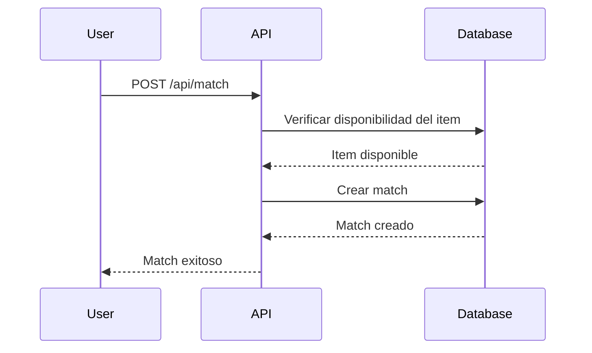
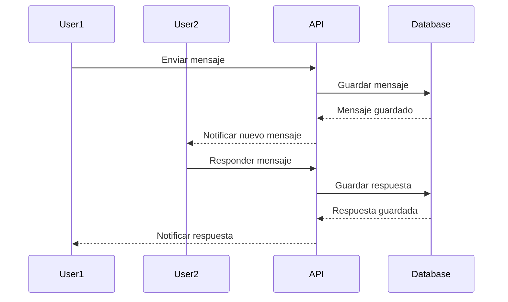

# Flujos de Datos

## Diagrama de Secuencia: Creación de Match

```mermaid
sequenceDiagram
    participant User
    participant API
    participant Database

    User->>API: POST /api/match
    API->>Database: Verificar disponibilidad del item
    Database-->>API: Item disponible
    API->>Database: Crear match
    Database-->>API: Match creado
    API-->>User: Match exitoso
```

## Diagrama de Secuencia: Chat Anónimo

```mermaid
sequenceDiagram
    participant User1
    participant User2
    participant API
    participant Database

    User1->>API: Enviar mensaje
    API->>Database: Guardar mensaje
    Database-->>API: Mensaje guardado
    API-->>User2: Notificar nuevo mensaje
    User2->>API: Responder mensaje
    API->>Database: Guardar respuesta
    Database-->>API: Respuesta guardada
    API-->>User1: Notificar respuesta
```