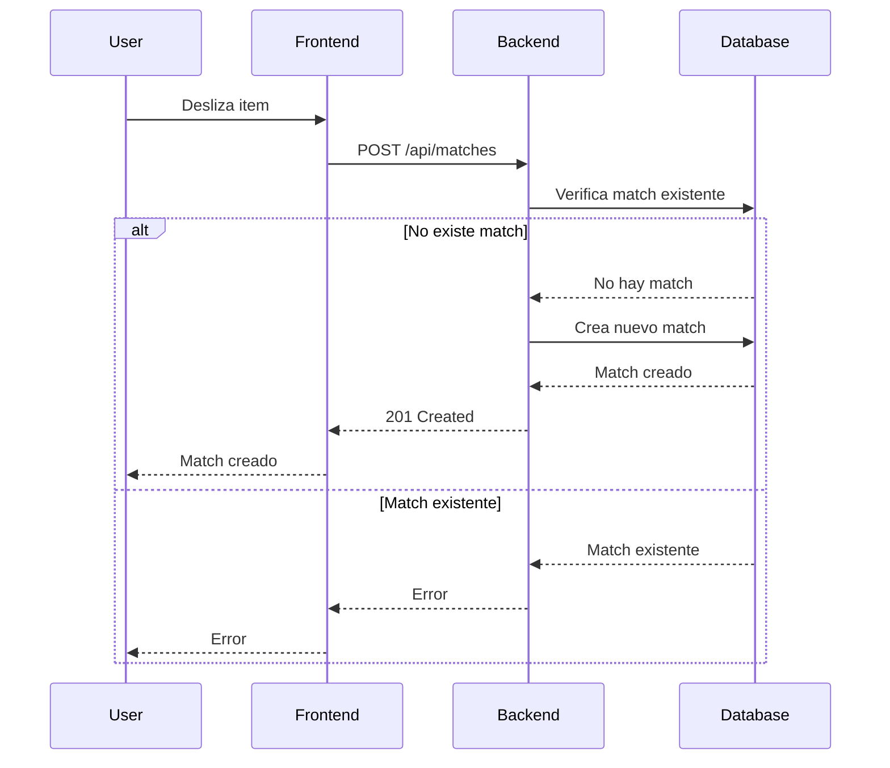
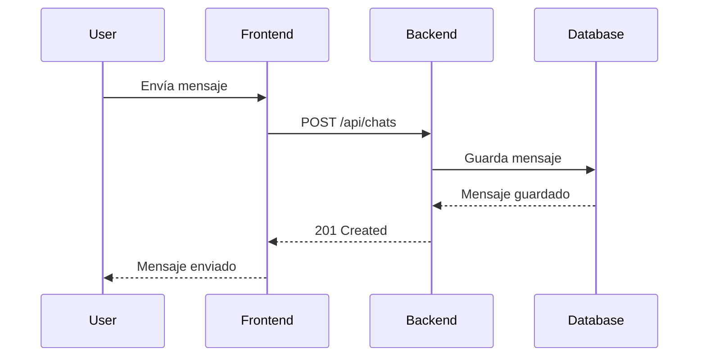

# Flujos de Datos

## Flujo de Creación de Match

```mermaid
sequenceDiagram
    participant User
    participant Frontend
    participant Backend
    participant Database

    User->>Frontend: Desliza item
    Frontend->>Backend: POST /api/matches
    Backend->>Database: Verifica match existente
    alt No existe match
        Database-->>Backend: No hay match
        Backend->>Database: Crea nuevo match
        Database-->>Backend: Match creado
        Backend-->>Frontend: 201 Created
        Frontend-->>User: Match creado
    else Match existente
        Database-->>Backend: Match existente
        Backend-->>Frontend: Error
        Frontend-->>User: Error
    end
```

## Flujo de Chat

```mermaid
sequenceDiagram
    participant User
    participant Frontend
    participant Backend
    participant Database

    User->>Frontend: Envía mensaje
    Frontend->>Backend: POST /api/chats
    Backend->>Database: Guarda mensaje
    Database-->>Backend: Mensaje guardado
    Backend-->>Frontend: 201 Created
    Frontend-->>User: Mensaje enviado
```