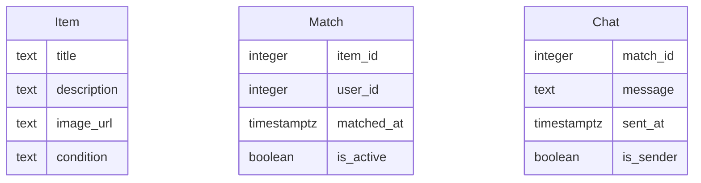

# Modelo de Datos

## Diagrama ER

## Descripción de Entidades y Relaciones
- **Item**: Representa un objeto que un usuario desea intercambiar o regalar. Incluye título, descripción, URL de imagen y condición.
- **Match**: Relaciona un item con un usuario cuando hay interés mutuo. Incluye la fecha del match y si está activo.
- **Chat**: Mensajes intercambiados entre usuarios sobre un match específico. Incluye el contenido del mensaje, la fecha de envío y si el usuario es el remitente.