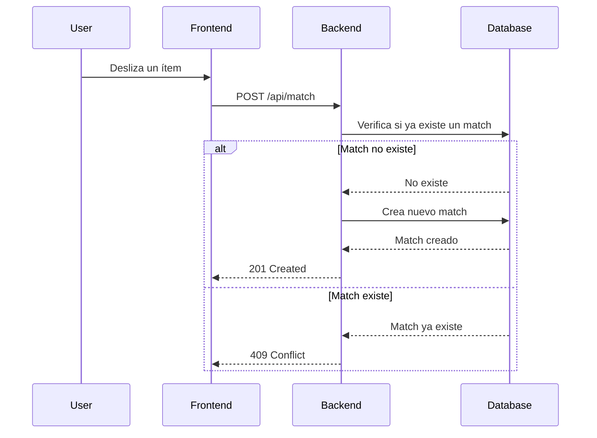
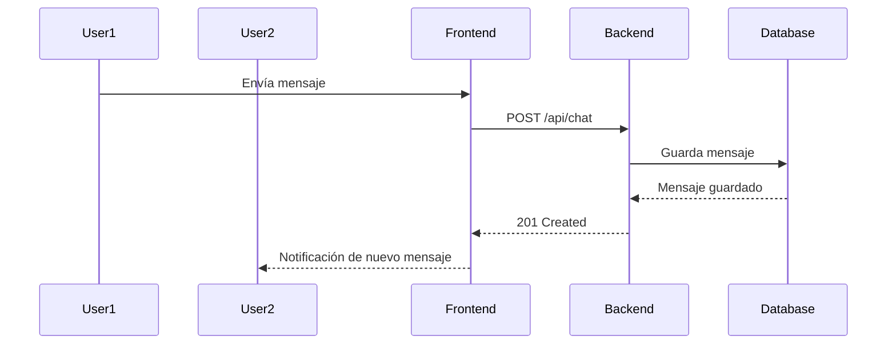

# Flujos de Datos de Truke

## Flujo de Creación de Match

```mermaid
sequenceDiagram
    participant User
    participant Frontend
    participant Backend
    participant Database

    User->>Frontend: Desliza un ítem
    Frontend->>Backend: POST /api/match
    Backend->>Database: Verifica si ya existe un match
    alt Match no existe
        Database-->>Backend: No existe
        Backend->>Database: Crea nuevo match
        Database-->>Backend: Match creado
        Backend-->>Frontend: 201 Created
    else Match existe
        Database-->>Backend: Match ya existe
        Backend-->>Frontend: 409 Conflict
    end
```

## Flujo de Mensajería en el Chat

```mermaid
sequenceDiagram
    participant User1
    participant User2
    participant Frontend
    participant Backend
    participant Database

    User1->>Frontend: Envía mensaje
    Frontend->>Backend: POST /api/chat
    Backend->>Database: Guarda mensaje
    Database-->>Backend: Mensaje guardado
    Backend-->>Frontend: 201 Created
    Frontend-->>User2: Notificación de nuevo mensaje
```