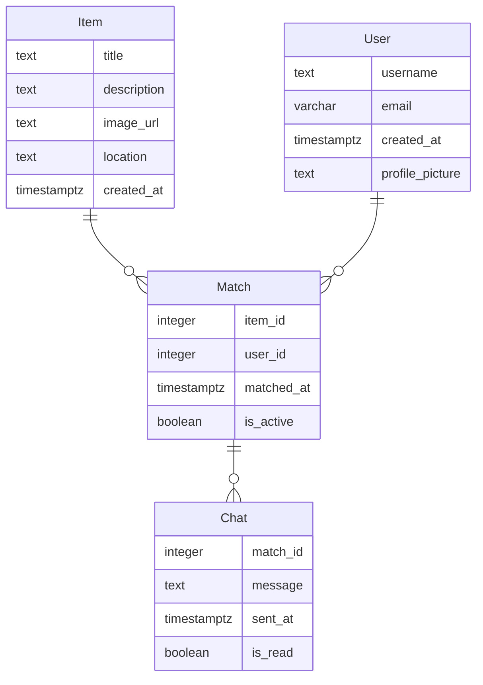

# Modelo de Datos de Truke

## Diagrama ER

## Descripción de Entidades y Relaciones
- **Item**: Representa un objeto que un usuario desea intercambiar o regalar. Incluye título, descripción, imagen, ubicación y fecha de creación.
- **Match**: Relaciona un ítem con un usuario que ha mostrado interés. Incluye el ID del ítem, el ID del usuario, la fecha de match y si el match está activo.
- **Chat**: Contiene mensajes intercambiados entre usuarios que han hecho match. Incluye el ID del match, el mensaje, la fecha de envío y si el mensaje ha sido leído.
- **User**: Representa a un usuario de la aplicación. Incluye nombre de usuario, correo electrónico, fecha de creación y foto de perfil.

Las relaciones entre las entidades permiten gestionar los ítems, los matches entre usuarios y la comunicación a través del chat.