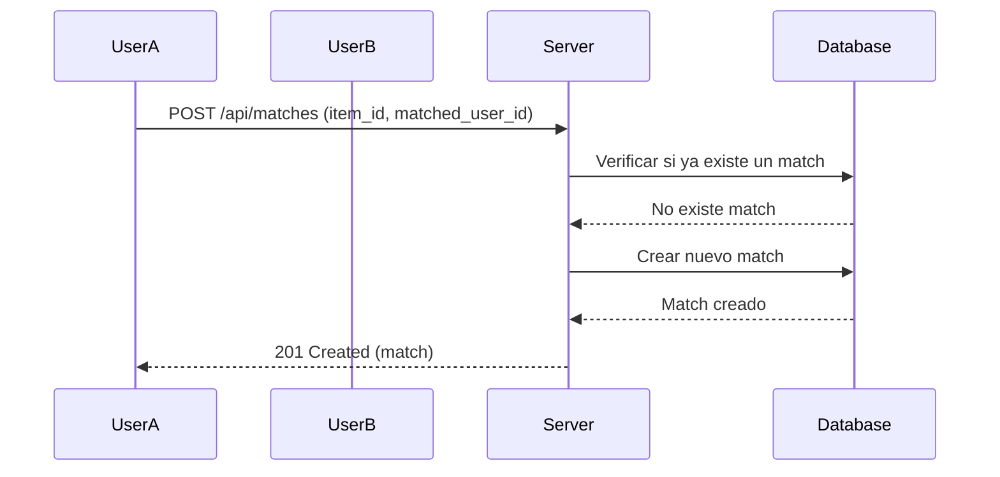
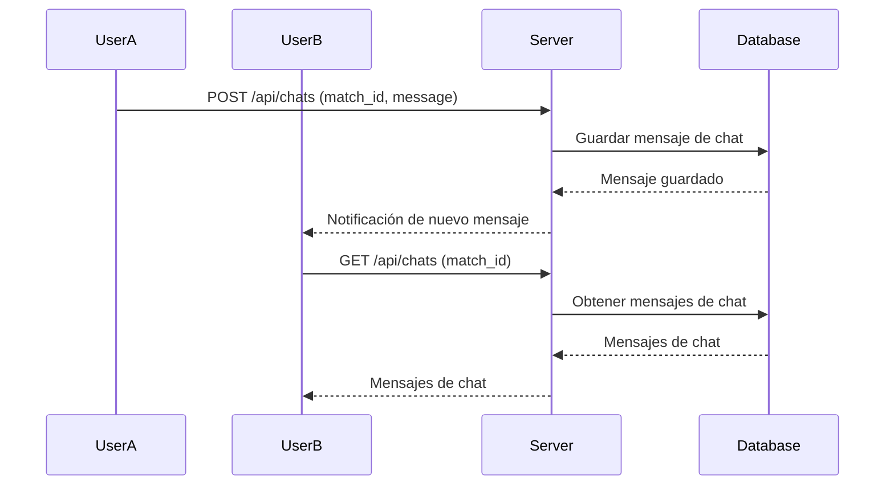

# Flujos de Datos

## Diagrama de Secuencia de Creación de Match

```mermaid
sequenceDiagram
    participant UserA
    participant UserB
    participant Server
    participant Database

    UserA->>Server: POST /api/matches (item_id, matched_user_id)
    Server->>Database: Verificar si ya existe un match
    Database-->>Server: No existe match
    Server->>Database: Crear nuevo match
    Database-->>Server: Match creado
    Server-->>UserA: 201 Created (match)
```

## Diagrama de Secuencia de Chat

```mermaid
sequenceDiagram
    participant UserA
    participant UserB
    participant Server
    participant Database

    UserA->>Server: POST /api/chats (match_id, message)
    Server->>Database: Guardar mensaje de chat
    Database-->>Server: Mensaje guardado
    Server-->>UserB: Notificación de nuevo mensaje
    UserB->>Server: GET /api/chats (match_id)
    Server->>Database: Obtener mensajes de chat
    Database-->>Server: Mensajes de chat
    Server-->>UserB: Mensajes de chat
```