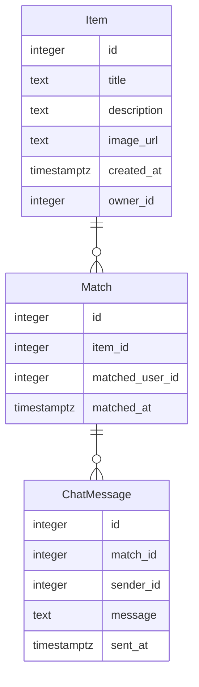

# Modelo de Datos

## Diagrama ER

## Descripción de Entidades y Relaciones
- **Item**: Representa un objeto que un usuario desea intercambiar o regalar. Incluye un título, descripción, URL de imagen, fecha de creación y el ID del propietario.
- **Match**: Indica un interés mutuo entre dos usuarios sobre un ítem. Contiene el ID del ítem, el ID del usuario que mostró interés y la fecha del match.
- **ChatMessage**: Representa un mensaje en un chat asociado a un match. Incluye el ID del match, el ID del remitente, el contenido del mensaje y la fecha de envío.

Las relaciones son tales que un `Item` puede tener múltiples `Match`, y un `Match` puede tener múltiples `ChatMessage`.