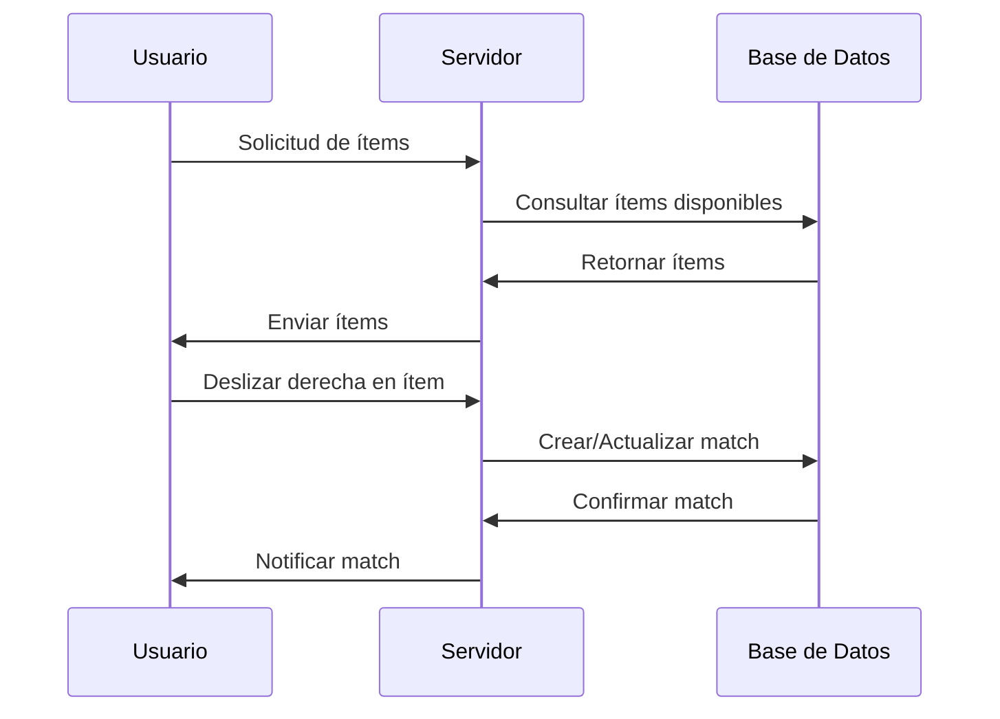
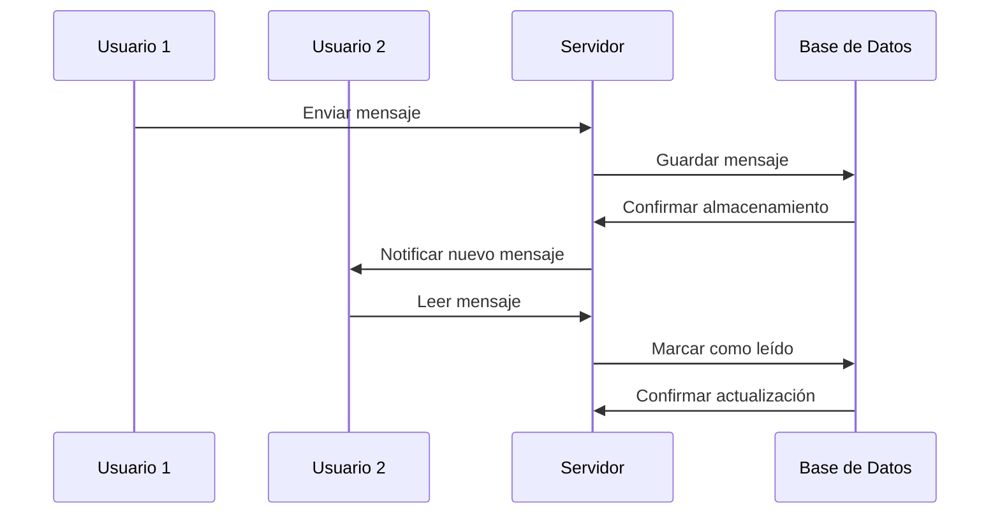

# Flujos de Datos

## Flujo de Usuario: Deslizar y Match

```mermaid
sequenceDiagram
    participant U as Usuario
    participant S as Servidor
    participant DB as Base de Datos

    U->>S: Solicitud de ítems
    S->>DB: Consultar ítems disponibles
    DB->>S: Retornar ítems
    S->>U: Enviar ítems
    U->>S: Deslizar derecha en ítem
    S->>DB: Crear/Actualizar match
    DB->>S: Confirmar match
    S->>U: Notificar match
```

## Flujo de Datos: Chat

```mermaid
sequenceDiagram
    participant U1 as Usuario 1
    participant U2 as Usuario 2
    participant S as Servidor
    participant DB as Base de Datos

    U1->>S: Enviar mensaje
    S->>DB: Guardar mensaje
    DB->>S: Confirmar almacenamiento
    S->>U2: Notificar nuevo mensaje
    U2->>S: Leer mensaje
    S->>DB: Marcar como leído
    DB->>S: Confirmar actualización
```