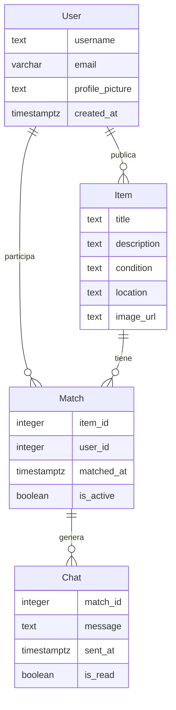

# Modelo de Datos

## Diagrama ER

## Descripción de Entidades y Relaciones
- **Item**: Representa un objeto que un usuario desea intercambiar o regalar. Incluye título, descripción, condición, ubicación y URL de imagen.
- **Match**: Indica que dos usuarios han mostrado interés mutuo en los ítems del otro. Contiene referencias a `item_id` y `user_id`, junto con la fecha de match y su estado activo.
- **Chat**: Permite a los usuarios comunicarse sobre un ítem que ha hecho match. Incluye el `match_id`, el mensaje, la fecha de envío y si ha sido leído.
- **User**: Representa a un usuario de la aplicación, con nombre de usuario, correo electrónico, foto de perfil y fecha de creación.