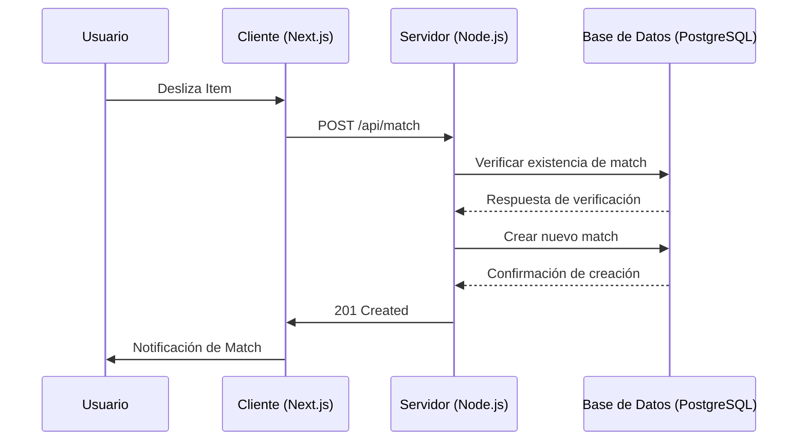
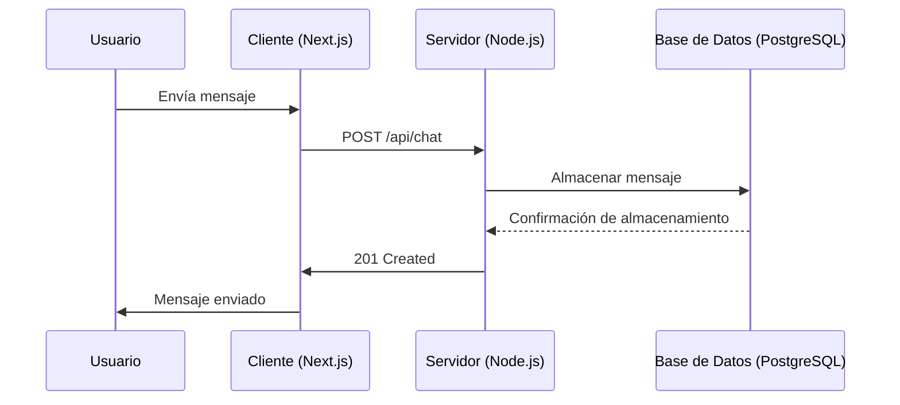

# Flujos de Datos Clave

## Diagrama de Secuencia: Flujo de Match

```mermaid
sequenceDiagram
    participant User as Usuario
    participant Frontend as Cliente (Next.js)
    participant Backend as Servidor (Node.js)
    participant DB as Base de Datos (PostgreSQL)

    User->>Frontend: Desliza Item
    Frontend->>Backend: POST /api/match
    Backend->>DB: Verificar existencia de match
    DB-->>Backend: Respuesta de verificación
    Backend->>DB: Crear nuevo match
    DB-->>Backend: Confirmación de creación
    Backend->>Frontend: 201 Created
    Frontend->>User: Notificación de Match
```

## Diagrama de Secuencia: Flujo de Chat

```mermaid
sequenceDiagram
    participant User as Usuario
    participant Frontend as Cliente (Next.js)
    participant Backend as Servidor (Node.js)
    participant DB as Base de Datos (PostgreSQL)

    User->>Frontend: Envía mensaje
    Frontend->>Backend: POST /api/chat
    Backend->>DB: Almacenar mensaje
    DB-->>Backend: Confirmación de almacenamiento
    Backend->>Frontend: 201 Created
    Frontend->>User: Mensaje enviado
```