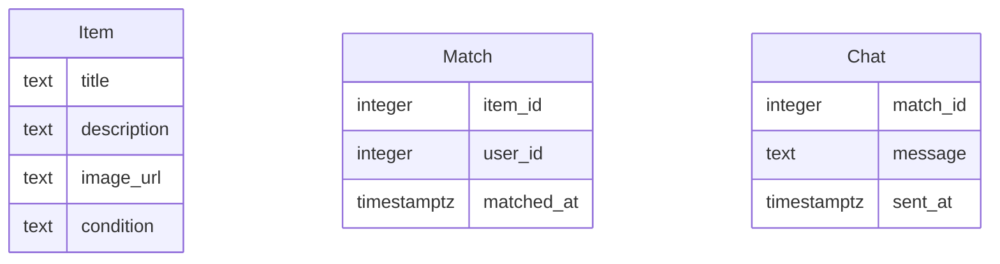

# Modelo de Datos

## Diagrama ER

## Descripción de Entidades y Relaciones

### Item
- **title**: Título del item.
- **description**: Descripción detallada del item.
- **image_url**: URL de la imagen del item.
- **condition**: Estado del item (nuevo, como nuevo, usado, desgastado).

### Match
- **item_id**: Identificador del item que hizo match.
- **user_id**: Identificador del usuario que hizo match.
- **matched_at**: Fecha y hora en que se realizó el match.

### Chat
- **match_id**: Identificador del match asociado al chat.
- **message**: Contenido del mensaje.
- **sent_at**: Fecha y hora en que se envió el mensaje.