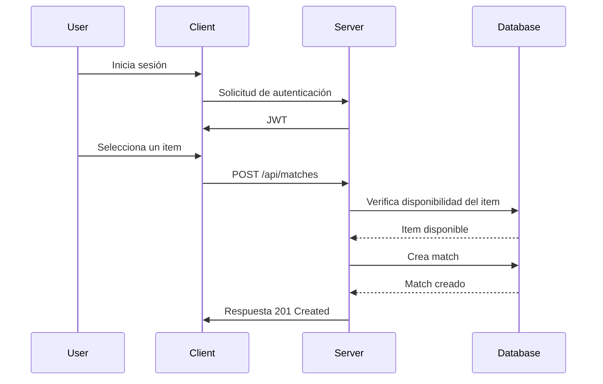
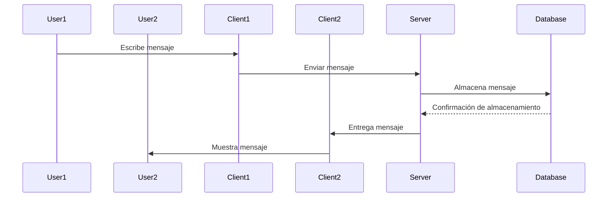

# Flujos de Datos

## Diagrama de Secuencia: Creación de Match

```mermaid
sequenceDiagram
    participant User
    participant Client
    participant Server
    participant Database

    User->>Client: Inicia sesión
    Client->>Server: Solicitud de autenticación
    Server->>Client: JWT
    User->>Client: Selecciona un item
    Client->>Server: POST /api/matches
    Server->>Database: Verifica disponibilidad del item
    Database-->>Server: Item disponible
    Server->>Database: Crea match
    Database-->>Server: Match creado
    Server->>Client: Respuesta 201 Created
```

## Diagrama de Secuencia: Envío de Mensaje de Chat

```mermaid
sequenceDiagram
    participant User1
    participant User2
    participant Client1
    participant Client2
    participant Server
    participant Database

    User1->>Client1: Escribe mensaje
    Client1->>Server: Enviar mensaje
    Server->>Database: Almacena mensaje
    Database-->>Server: Confirmación de almacenamiento
    Server->>Client2: Entrega mensaje
    Client2->>User2: Muestra mensaje
```