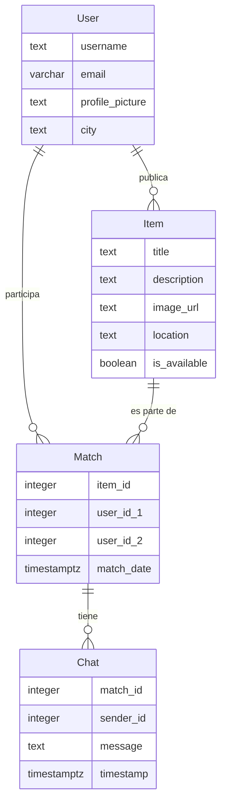

# Modelo de Datos

## Diagrama ER

## Descripción de Entidades y Relaciones
- **Item**: Representa un objeto que un usuario desea intercambiar. Incluye título, descripción, imagen, ubicación y disponibilidad.
- **Match**: Representa una coincidencia entre dos usuarios interesados en el mismo item. Incluye referencias a los usuarios y el item.
- **Chat**: Contiene mensajes intercambiados entre usuarios que han hecho match.
- **User**: Representa a un usuario de la aplicación, con información de contacto y ubicación.

Las relaciones definen cómo los usuarios interactúan con los items y entre sí a través de matches y chats.