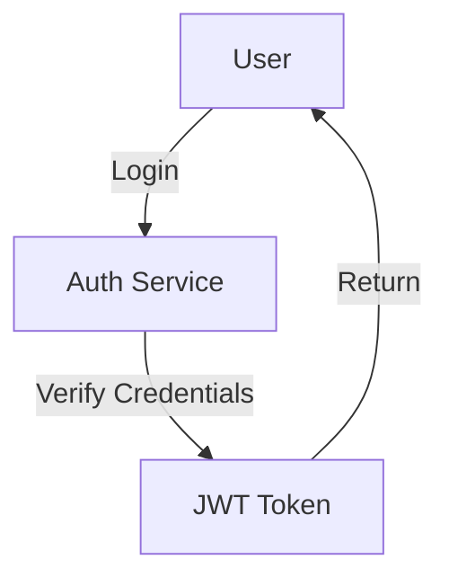
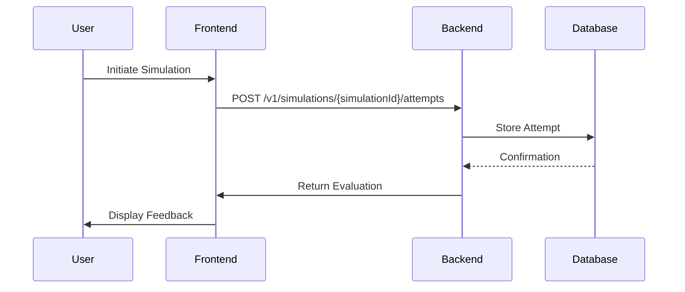
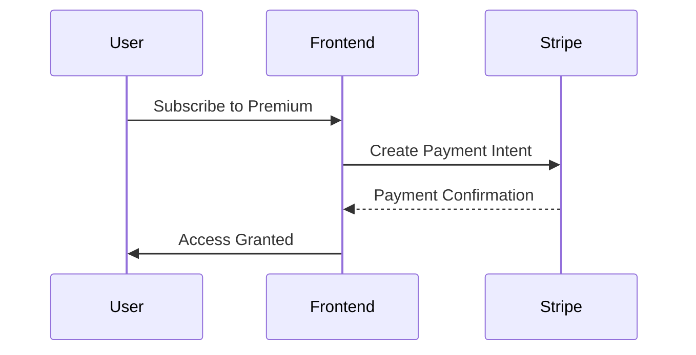

# Data Flows

## Key User/Data Flows

### User Authentication

```mermaid
graph TD;
  A[User] -->|Login| B[Auth Service];
  B -->|Verify Credentials| C[JWT Token];
  C -->|Return| A;
```

### Simulation Attempt Submission

```mermaid
sequenceDiagram
  participant U as User
  participant FE as Frontend
  participant BE as Backend
  participant DB as Database

  U->>FE: Initiate Simulation
  FE->>BE: POST /v1/simulations/{simulationId}/attempts
  BE->>DB: Store Attempt
  DB-->>BE: Confirmation
  BE->>FE: Return Evaluation
  FE->>U: Display Feedback
```

### Payment Processing

```mermaid
sequenceDiagram
  participant U as User
  participant FE as Frontend
  participant S as Stripe

  U->>FE: Subscribe to Premium
  FE->>S: Create Payment Intent
  S-->>FE: Payment Confirmation
  FE->>U: Access Granted
```