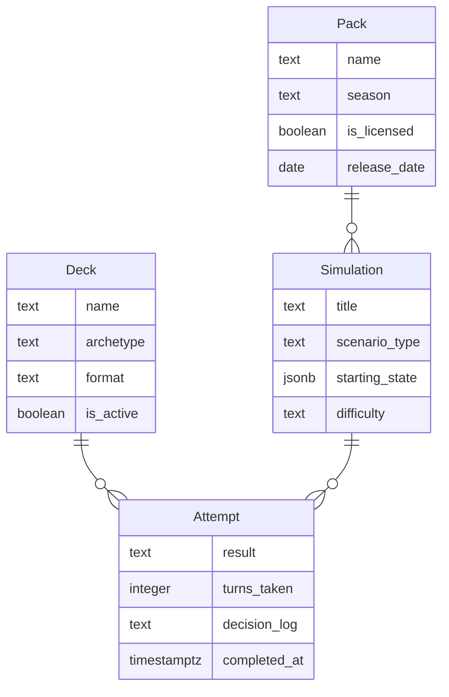

# Data Model

## Entity-Relationship Diagram

## Entity Descriptions
- **Deck**: Represents a collection of cards used in simulations, characterized by its name, archetype, format, and active status.
- **Simulation**: Defines a duel scenario with a title, scenario type, starting state, and difficulty level.
- **Attempt**: Captures a user's attempt at a simulation, including the result, turns taken, decision log, and completion timestamp.
- **Pack**: Represents a set of cards available in a specific season, with licensing information and release date.